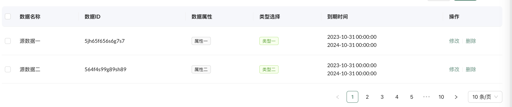
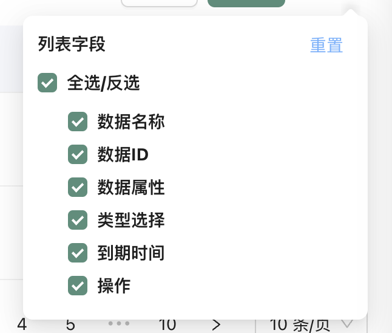
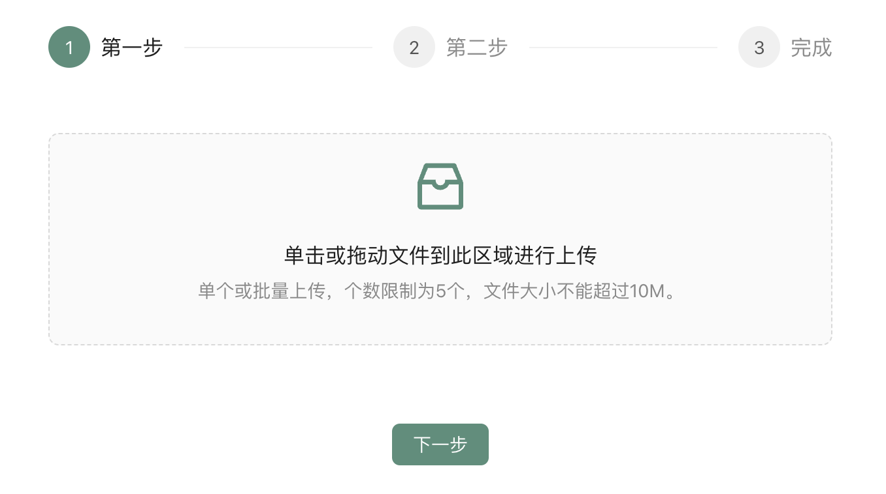
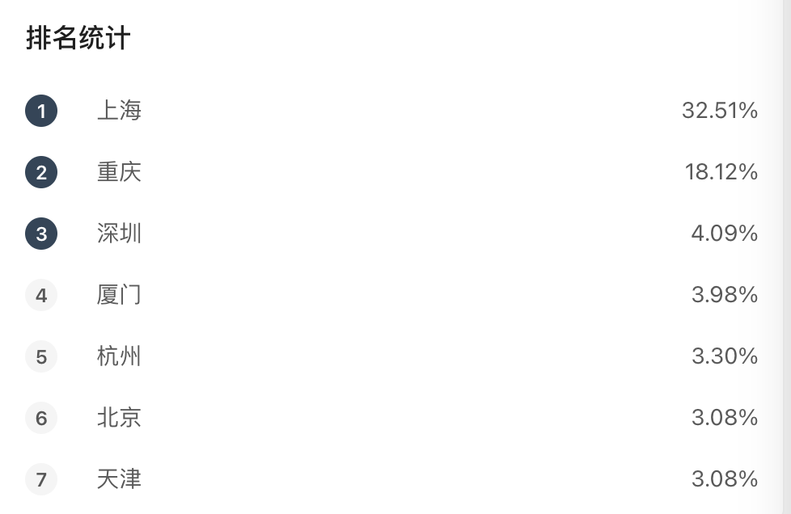
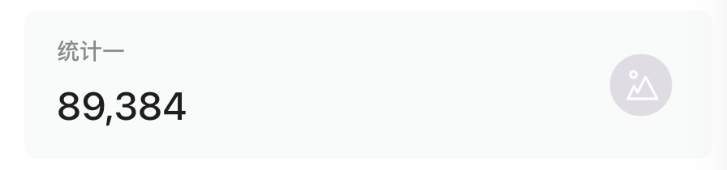
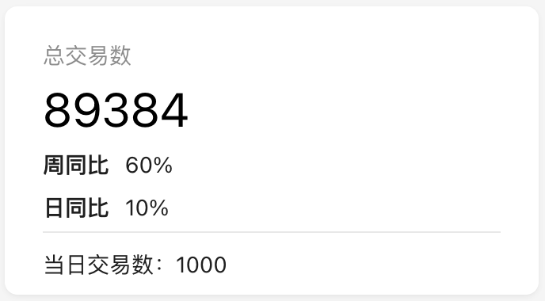
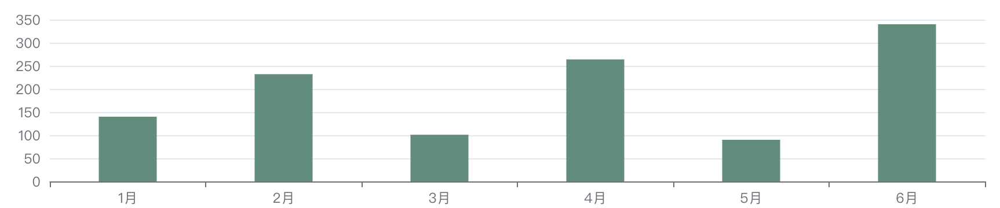

# 使用说明文档 v1.0

## 开始使用

vue3-wh-admin 是基于 Ant Design 和 vue3 封装的一整套企业级中后台前端/设计解决方案，致力于在设计规范和基础组件的基础上，继续向上构建，提炼出典型模板/业务组件/配套设计资源，进一步提升企业级中后台产品设计研发过程中的『用户』和『设计者』的体验。

框架力求提供开箱即用的开发体验，为此我们提供较为基础的能力，包含国际化、http请求、主题色切换、基础组件等各方面，减少学习和开发成本。

### 技术栈

- Node.js前端开发基础环境

- webpack打包工具

- vue3 主要技术栈

- vue-router 路由工具

- vue-i18n 国际化工具

- pinia 状态管理工具

- Ant Design UI库


### 准备工作

#### 初始化项目

版本要求：nodeJs  v16+， 推荐使用npm来进行包管理

```
// 使用 npm
npm install 或淘宝镜像 cnpm install
```

#### 开发

初始化成功之后就可以开始进行开发了，我们提供了一些命令来辅助开发。

`npm run serve`

运行这个脚本会启动服务，自动打开默认浏览器展示你的页面。当你重新编辑代码后，页面还会自动刷新。

`npm run build`

运行这个脚本将会编译你的项目，你可以在项目中的 dist 目录中找到编译后的文件用于部署。


## 基础使用

### 文件结构

我们已经为你生成了一个完整的开发框架，提供了涵盖中后台开发的各类功能和坑位，下面是整个项目的目录结构。

```bash
├── public
│   └── favicon.png          # Favicon
├── src
│   ├── api                  # 接口定义
│   ├── assets               # 本地静态资源
│   ├── basics               # 框架通用配置
│   ├── components           # 业务通用组件
│   ├── directive            # 全局指令
│   ├── hooks                # vue hook
│   ├── layout               # 整体布局
│   ├── plugins              # 全局方法
│   ├── router               # vue路由
│   ├── store                # pinia封装
│   ├── utils                # 工具方法
│   ├── views                # vue页面
│   ├── App.vue              # vue主页面
│   └── main.js.             # 入口文件
├── .env.development         # 开发环境变量
├── .env.production          # 生产环境变量
├── babel.config.js          # babel配置
├── vue.config.js            # webpack运行及打包配置
├── README.md
└── package.json
```

### 页面代码结构推荐

为了让项目代码组织更加规范，让开发能够更方便的定位到相关页面组件代码，我们定义了一套规范，该规范当前只作为推荐的指导，并非强制。

```bash
src
├── components
└── pages
   ├── user
   │   ├── handleComp        # 添加、编辑
   │   ├── searchComp        # 搜索
   │   ├── index.vue         # 列表
   
```

所有路由组件（会配置在路由配置中的vue页面）我们推荐以小驼峰命名放到views 下面第一级（复杂的项目可以增加 group 层级），

我们推荐尽可能把组件按更小的颗粒度进行拆分。通用组件放在src/components下，定制化业务组件放到views对应的目录内。

### 文件命名规范

文件夹为小驼峰方式命名

所有组件级文件夹都以“comp”为结尾 

```bash
src
├── components
│   ├── tableComp           # 通用组件
└── pages
   ├── user
   │   ├── handleComp       # 业务组件
   │   ├── searchComp       # 业务组件
   │   ├── detailComp       # 业务组件
   │   ├── videoComp        # 业务组件
   │   ├── index.vue        # 主文件
```


## 页面开发

### 新增页面

这里的『页面』指配置了路由，能够通过链接直接访问的模块，要新建一个页面，通常可以在框架的基础上进行简单的配置。

#### 创建文件

在 src / views 下创建新的目录，如果有一定复杂度，您可以在创建的目录内继续创建多个文件夹拆分页面逻辑，创建规则可参考 “基础使用 - 页面代码结构推荐”。

#### 增加路由

在src/router/index.js文件内定义新的路由对象

```bash
// 单页显示
const constantRoutes = [
		...
		{
				path: '/webpage',                                  # url定义
        component: Webpage,                                # 模块引入
        hidden: true,                                      # 是否在菜单中隐藏
        name: 'webpage'
		}
]

// 菜单目录
const constantRoutes = [
		...
		{
				path: '/form',                                     # 一级菜单
        component: Layout,                                 # 指定父级（整体布局）
        alwaysShow: true,                                  # 有子菜单
        redirect: '/form/basicForm',                       # 重定向路由
        meta: { title: '表单页', icon: 'FormOutlined' },    # 一级菜单显示的Ant Design图标及名称
        children: [{ 
                path: 'webpage',                           # url定义 
                name: 'webpage',
                component: Webpage,                        # 模块引入
                meta: { title: '基础表单' }                 # 二级菜单显示的图标及名称
            },
        ]
		}
]
   
```


### 业务模块页面结构

```vue
# 参考 src/list/tableList/index.vue
<template>
  <div class="app-container">
        <!-- 1. 搜索组件 -->
        <!-- 2. 表格控件组件及按钮 -->
        <!-- 3. 表格及分页组件 -->
        <!-- 4. 添加/修改组件 -->
        <!-- 5. 详情组件 -->
  </div>
</template>
<script setup>
// 业务逻辑
</script>
<style lang="scss" scoped>
// 自定义样式
</style>
```


## 数据管理

### 状态管理器

框架内使用pinia作为状态管理器（可以理解为vuex简化版）。

动态切换国际化文案

```javascript
import useAppStore from '@/store/modules/app';
import { LONG } from '@/basics/enums/lang';

const appStore = useAppStore()
appStore.setLocale(LONG.english)
const lang = appStore.getLocale()
```

获取菜单路由集合

```javascript
import usePermissionStore from '@/store/modules/permission'
const permissionStore = usePermissionStore()

const sidebarRouters =  permissionStore.sidebarRouters
```

#### 自定义pinia

src/store/modules文件夹下新建js，或在已有文件中追加。

```javascript
const useDataStore = defineStore(
    'data', {
        state: () => ({
            objectData: {},
            stringData: '',
            arrayData: []
            ...
        }),
        // 获取 
        getters: {
            getObjectData() {
                return this.objectData
            },
            getStringData() {
                return this.stringData
            }
        },
        // 赋值
        actions: {
            setObjectData(e = {}) {
                this.objectData = e
            },
            setStringData(e = '') {
                this.stringData = e
            }
        }
    }
)
```


## 样式和资源

### 使用css

框架应用scss编写样式，为了统一样式规范，开发中需要引用src/assets/css/variables.scss文件内部定义的样式，框架内已经全局引用了这个文件，可以直接使用。

```css
// variables.scss
$base-theme: #558E7B;
$base-theme-hover: #bdf6e3;
$base-theme-active: #2196f3;
$base-theme-text: #333;
...
```

如果需要修改 **antd UI** 样式，进入到src/assets/css/antdRest.scss文件内进行修改。

#### 通用样式

在src/assets/css/common.scss文件内进行通用样式开发，需要符合框内架通用样式规范，抽象化命名，引用variables.scss定义的主题参数。

通用样式文件内提供了基础的样式class

- margin  0 - 50（px）

  规范：m + (t、b、l、r) + (像素值 5 的倍数，上限为50)

​	   使用：.mt5 .mt10 .mt15 .mt20...

- padding  0 - 30（px）

  规范：m + (t、b、l、r) + (像素值 5 的倍数，上限为30)

​	   使用：.pt5 .pt10 .pt15 .pt20...

​       开发时，可提升上限的值（30 --> 100），但不能降低。

#### 内联样式

vue模版代码中使用variables.scss内定义的主题参数

```scss
// variables.module.scss 增加需要导出的样式
:export {
    baseTheme: $base-theme;
    ... 
}
```

```vue
// vue
<template>
	<div :style="{'color': variables.baseTheme}"></div>
</template>
<script setup>
	import variables from '@/assets/css/variables.module.scss'
  console.log(variables.baseTheme)
</script>
```

### 动态主题

框架内默认主题是绿色，如果对视觉风格有额外的要求，推荐使用以下的方式进行定制。

进入src/assets/css/variables.scss文件，修改$base-theme通用主题配色。

### icon使用

查看antd官网图标：https://www.antdv.com/components/icon-cn，使用方式如下：

#### 单独使用

```vue
// 方式一
<template #icon>
   <DownloadOutlined />
</template>

// 方式二
<component is="CaretUpOutlined"></component>
```

#### 组合使用

```vue
// 组合使用
<a-button size="small" type="primary" ghost>
  <template #icon>
    <DownloadOutlined />
  </template>
  Download
</a-button>
```


### 全局指令使用

src/directive目录内查看或定义框架全局指令。

#### 按钮防抖

防止重复提交情况发生，开发中涉及http请求动作的按钮，需要按下面的方式进行使用。

```vue
// 使用
<a-button type="primary" v-debounce-click="handleOk">提交</a-button>
```

#### 自定义全局指令

创建指令：src/directive目录内新增js文件

注册指令：src/hook/registerGlobMethods.js文件内找到registerDirective方法增加注册代码。

```javascript
import newDirective from '@/directive/newDirective'
function registerDirective(app) {
    ...
    // 新增
    app.directive('指令名称', newDirective);
}
```


### 组件使用

为了达到开箱即用的开发体验，框架内提供了基础的组件。以下是组件的功能介绍及使用方法。


#### 基础业务组件

##### 表格组件



通用业务的表格组件，支持插槽自定义表格内容。

```javascript
// 引入
import tableComp from '@/components/tableComp'
```

**传参**

| 参数         | 名称     | 类型    | 默认值                       |
| ------------ | -------- | ------- | ---------------------------- |
| pages        | 分页参数 | Object  | {page:1,pageSize:10,total:0} |
| dataSource   | 数据源   | Array   | -                            |
| columns      | 表格列   | Array   | -                            |
| rowSelection | 行选择   | Object  | -                            |
| loading      | 加载效果 | Boolean | false                        |
| border       | 边框     | Boolean | false                        |
| size         | 表格大小 | String  | default                      |

**回调方法**

| 方法       | 名称     | 类型     |
| ---------- | -------- | -------- |
| changePage | 更新页码 | *@event* |

------


##### 表格工具



对于表格字段的显示/隐藏配置及刷新。

```javascript
// 引入
import tableConfigComp from '@/components/tableConfigComp'
```

**传参**

| 参数    | 名称       | 类型  | 默认值 |
| ------- | ---------- | ----- | ------ |
| columns | 表格列配置 | Array | []     |

**回调方法**

| 方法              | 名称       | 类型     |
| ----------------- | ---------- | -------- |
| refreshData       | 刷新数据   | *@event* |
| changeTableColumn | 改变表格列 | *@event* |

------


##### 弹窗组件

```javascript
// 引入
import modalHandleComp from '@/components/modalHandleComp';
```

**传参**

| 参数           | 名称             | 类型    | 默认值  |
| -------------- | ---------------- | ------- | ------- |
| visible        | *是否显示*       | Boolean | false   |
| title          | 标题             | String  | "操作"  |
| confirmLoading | 加载             | Boolean | false   |
| width          | 宽度             | String  | “700px” |
| isFoorter      | 是否显示底部按钮 | Boolean | false   |

##### 回调方法

当isFooter为false时，弹窗会使用默认的“确定”、“取消”按钮。

| 方法         | 名称         | 类型     |
| ------------ | ------------ | -------- |
| handleCancel | 点击取消按钮 | *@event* |
| handleOk     | 点击确定按钮 | *@event* |

------


##### 上传文件组件（支持多文件拖拽上传）



```javascript
// 引入
import uploadFileComp from '@/components/uploadFileComp';
```

```vue
// 获取上传后的文件
<upload-file-comp ref="uploadFileCompRef"></upload-file-comp>

<script setup>
  const uploadFileCompRef = ref(null);
  uploadFileCompRef.value.sendFileList();  // 文件列表数据
</script>  
```

**传参**

| 参数             | 名称                                           | 类型    | 默认值                      |
| ---------------- | ---------------------------------------------- | ------- | --------------------------- |
| multiple         | 是否支持批量上传                               | Boolean | true                        |
| allowedFileTypes | 允许的文件类型，可以根据需要修改               | Array   | ['doc','docx','xls','xlsx'] |
| maxFileSize      | 允许的最大文件大小，单位是MB，可以根据需要修改 | Number  | 10                          |
| maxFileCount     | 允许的最多上传的文件数量                       | Number  | 5                           |

------


##### 排名情况list组件



```javascript
// 引入
import rankListComp from '@/components/rankListComp' 
```

**传参**

| 参数 | 名称     | 类型    | 默认值 |
| ---- | -------- | ------- | ------ |
| list | 列表数据 | Boolean | null   |

```javascript
// 参数事例
const list = [{
	name: '名称'，
	total: '展示数量'
}]
```

------


##### 数据统计小卡片



```javascript
// 引入
import statisticComp from '@/components/statisticComp/typeOne.vue'
```

**传参**

| 参数      | 名称                           | 类型   | 默认值 |
| --------- | ------------------------------ | ------ | ------ |
| title     | 标题                           | String | -      |
| number    | 统计数量（组件自动添加千分符） | Number | 0      |
| icon      | 图标                           | String | -      |
| titleLink | 点击标题跳转链接               | String | -      |
| style     | 自定义样式                     | Object | -      |
| className | 样式class                      | String | -      |

------


##### 百分比趋势组件



```javascript
// 引入
import trendComp from '@/components/trendComp'
```

**传参**

| 参数      | 名称      | 类型   | 默认值 |
| --------- | --------- | ------ | ------ |
| label     | 标题      | String | -      |
| percent   | 百分比    | String | -      |
| icon      | 图标      | String | -      |
| color     | 图标颜色  | String | -      |
| className | 样式class | String | -      |

------


##### 统计容器卡片组件

```javascript
// 引入
import chartCardComp from '@/components/chartCardComp'
```

**传参**

| 参数    | 名称     | 类型                     | 默认值 |
| ------- | -------- | ------------------------ | ------ |
| title   | 标题     | String                   | -      |
| total   | 统计数量 | String, Number, Function | -      |
| loading | 加载     | Boolean                  | false  |

**插槽**

```vue
<slot name="title"></slot>  // 顶部标题
<slot name="action"></slot> // 顶部内容
<slot name="total"></slot>  // 统计数量
<slot></slot>               // 默认（主体）插槽
<slot name="footer"></slot> // 底部
```


#### echarts基础图表组件

##### echarts容器

```javascript
// 引入
import echartsComp from '@/components/echartsComp'
```

**传参**

| 参数   | 名称            | 类型   | 默认值 |
| ------ | --------------- | ------ | ------ |
| option | echarts配置数据 | Object | false  |

##### **option入参前赋值**



```javascript
// 柱状图 - 赋值option
import { getBarOption } from '@/components/echartsComp/example/bar'

const option = getBarOption({
  color: '#000',                                        // 柱-颜色
  xdata: ['1月', '2月', '3月', '4月', '5月', '6月'],      // x轴数据
  data: [140, 232, 101, 264, 90, 300],                  // y轴数据
  barWidth: '50'                                        // 柱-宽度
})
```

展示的例子为柱状图option赋值的代码，更多例子在src/components/echartsComp/example文件夹下，后续有其他图表demo，可查看封装规范进行添加。


